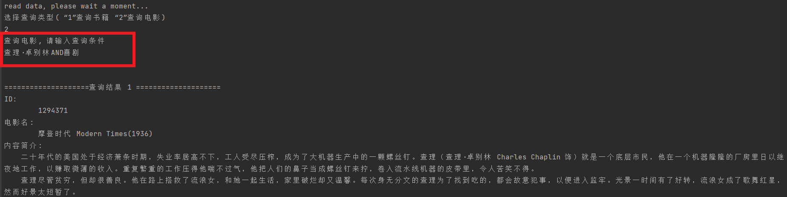
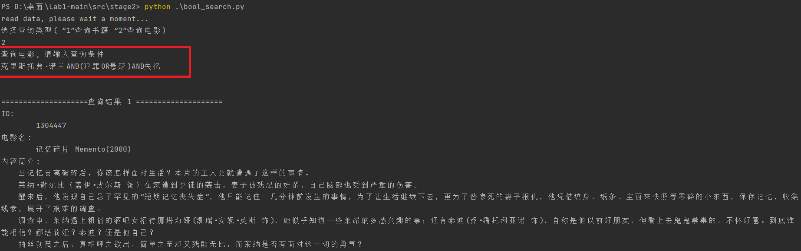
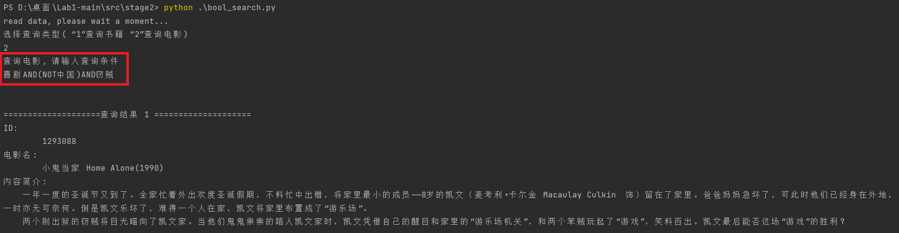
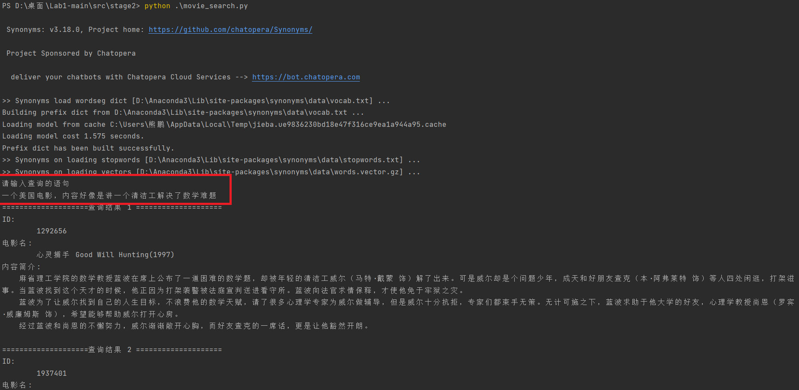

# 实验 1 信息获取与检索分析

方羿 PB19111647	熊鹏 PB19111671	张舒恒 PB19030888

## stage1. 爬虫

### 实验要求

> 针对给定的电影、书籍 ID，爬取其豆瓣主页，并解析其基本信息。
>
> a) 对于电影数据，至少爬取其基本信息、剧情简介、演职员表；
>
> b) 对于书籍数据，至少爬取其基本信息、内容简介、作者简介；
>
> c) 爬虫方式不限，网页爬取和 API 爬取两种方式都可，介绍使用的爬虫方式工具；
>
> d) 针对所选取的爬虫方式，发现并分析平台的反爬措施，并介绍采用的应对策略；
>
> e) 针对所选取的爬虫方式，使用不同的内容解析方法，并提交所获取的数据。
>
> f) 该阶段无评测指标要求，在实验报告中说明爬虫（反爬）策略和解析方法即可。


### 实验设计

本实验总共分为爬取数据+解析数据两个阶段，具体如下：

#### 一、爬取数据

##### 页面获取

数据爬取采用的是 python 的 requests 库，通过直接请求对应的 url, 获取 html 的内容。

这里以电影爬取为例，来说明具体实现过程：

``` python
# 获取具体的 movie_id
id = movie_id[k]	
# 根据 movie_id 构造 url
url = "https://movie.douban.com/subject/" + id + "/"
# 通过 request 库获取对应的 html 网页内容
response = requests.get(url,headers=headers)
content = response.content.decode('utf8')
```

##### 反爬策略

对于未登录用户的网页请求，**豆瓣规定同一 ip 地址在一定时间内最多请求100多次**；但对于登录的用户，则没有这一限制。

因此我们采取的反爬策略是：**通过携带 cookie 进行请求，模拟登录过的用户，从而绕过豆瓣的限制。**具体实现：

- 先通过浏览器获得登录后的 cookie
- 在 header 中携带 cookie  数据

``` python
headers = {
    "User-Agent": "Mozilla/5.0 (Windows NT 6.1; WOW64; rv:6.0) Gecko/20100101 Firefox/6.0",
    "Cookie": '这里是登录后的用户的cookie,因为很长,这里就没直接粘贴上来'
}
```

#### 二、解析数据

在获取了 html 数据后，下一步就是从 html 中获取需要的信息。这里我采用的是**用 xpath 解析 html 文档**，来获取需要的信息。

这里以电影为例，说明具体过程：

``` python
# 用一个字典来存电影信息
movie = {"id":id,"电影名":"","基本信息":"","剧情简介":"","演职员":"","豆瓣评分":""}
# 解析 html 文档
html = etree.HTML(content)
# 获取电影名
title = html.xpath('//*[@id="content"]/h1/span/text()')
for str in title:
    movie["电影名"] += str
# 获取评分信息
rating = html.xpath('//div[@class="rating_self clearfix"]//strong/text()')
if len(rating):
    movie["豆瓣评分"] += html.xpath('//div[@class="rating_self clearfix"]//strong/text()')[0]
else:   # 《建国大业》等电影禁止评分
    movie["豆瓣评分"] = "暂无评分"
# 获取基本信息
info = html.xpath('//*[@id="info"]/span/text() | //*[@id="info"]/span//a/text() | //*[@id="info"]
for str in info:
    if str[0] == '\n':
        movie["基本信息"] += '\n'
    else:
        movie["基本信息"] += str
# 获取完整的简介
intro = html.xpath('//span[@class="all hidden"]/text()')
if len(intro) == 0:
    intro = html.xpath('//span[@property="v:summary"]/text()')
for str in intro:
    str = str.strip("\n").strip(" ").strip("\n")
    movie["剧情简介"] += str + '\n'
# 获取演职员表
stuff = html.xpath('//li[@class="celebrity"]//span/text() | //li[@class="celebrity"]//span//a/tex
for i, str in enumerate(stuff):
    movie["演职员"] += str + " "
    if i % 2 != 0 :
        movie["演职员"] += "\n"
```


### 结果展示

- 具体代码详见 `stage1/catch_book.py` 和 `stage1/catch_movie.py` 

- 电影和书籍的爬取详细结果见：`stage1/data/movie.csv` 和 `stage1/data/book.csv`

- 这里仅展示部分截图

  <center>
      
      <br>
      <div style="color:orange; 
  border-bottom: 1px solid 
  #d9d9d9;
      display: inline-block;
      color: #999;
      padding: 2px;">电影爬取结果</div>
  </center>

<center>
    
    <br>
    <div style="color:orange; 
border-bottom: 1px solid 
#d9d9d9;
    display: inline-block;
    color: #999;
    padding: 2px;">书籍爬取结果</div>
</center>


## stage 2. 布尔检索

### 实验要求

>基于第一阶段爬取的豆瓣 Movie/Book 信息，实现电影或书籍的搜索引擎。对于给定的查询，能够以精确查询或模糊语义匹配的方法返回最相关的书籍或者电影集。
>
>**1. 对一阶段中爬取的电影和书籍数据进行预处理，将文本表征为关键词集合**
>
>**2. 在经过预处理的数据集上建立倒排索引表**𝑺**，并以合适的方式存储生成的倒排索引文件**
>
>**3. 对于给定的 bool 查询，根据你生成的倒排索引表，返回符合查询规则的电影或/和书籍集合并以合适的方式展现给用户**

### 实验设计

#### 一、分词

分词使用了结巴分词库，同时人工提取了一些如 人名、电影名之类的特殊名词，加入到结巴分词的人工字典中，帮助更好的分词。

这里以电影为例，说明具体的实现：

``` python
movie_data = pd.read_csv("./data/movie.csv")
movie_tag = pd.read_csv("./data/Movie_tag.csv")
col_name = ['id', 'words']
movie_words = []
# 读取每个电影
for _,movie in tqdm(movie_data.iterrows(), total=movie_data.shape[0], leave=False):
    # 对电影的基本信息、演职员表等进行分词
    key_words = split_movie(movie)
    # 读取电影的 tag 
    tags = list(movie_tag.loc[movie_tag['id'] == movie['id']]['tag'])[0]
    tag_words = set(str(tags).split(","))
    key_words = set.union(key_words, tag_words)
    key_words = key_words - stopwords
    # 存每个电影的分词结果
    movie_words.append({'id': movie['id'], 'words': key_words})
# 将分词结果存下来，方便下一位同学使用
pd.DataFrame(movie_words,columns=col_name).to_csv("./data/movie_words.csv",index=False)
with open("./data/word_dict.pkl","wb") as f:
    pickle.dump(word_dict,f)
print("split movie finish!")
```

具体的电影分词函数如下：

``` python
def split_movie(movie):
    key_words = set()
    # 电影ID作为一个词
    key_words.add(str(movie['id']))
    # 电影名的分词
    name = str(movie['电影名'])
    idx = name.find("(")
    if idx != -1:  # 删除后面的年份
        key_words.add(name[idx + 1:-1])
        name = name[:idx]
    chinese, english = split_English(name)  # 保留英文名的完整性
    if len(english) != 0:
        key_words.add(english)
    for word in chinese.split():  # 对于韩文和日文等没有处理
        key_words.add(word)
    # 电影基本信息、演职员表、剧情简介的分词
    info = str(movie['基本信息'])
    stuff = str(movie['演职员'])
    intro = str(movie['剧情简介'])
    key_words = set.union(key_words, split_movie_stuff(stuff))
    key_words = set.union(key_words, split_movie_info(info))
    for word in key_words:
        word = str(word)
        jieba.add_word(word)
        word_dict.append(word)
    key_words = set.union(key_words, set(jieba.cut_for_search(intro)))
    for word in key_words:
        word = str(word)
        jieba.del_word(word)
    return key_words
```

#### 二、建立倒排表

读取每部电影或书籍简介的分词结果，统计出所有的词项

```python
def read_csv():
    book_data = pd.read_csv("../data/book_words.csv", dtype={'id': int, 'words': str})
    # print(book_data.head())
    data = book_data
    words_all_book = set()
    book = dict()
    for i in range(len(data)):
        words_a_book = eval(data['words'][i])
        book[data['id'][i]] = words_a_book
        words_all_book = words_all_book.union(words_a_book)
```

遍历每个词项，统计出现该词项的文档集合，按照文档编号升序排列，生成倒排表。对于长度超过一定阈值的倒排表生成单层定长的跳表指针序列。

```python
def gen_invert_table():
    invert_index = []
    words_all_book, book, words_all_movie, movie = read_csv()
    for b in words_all_book:
        temp = []
        skip_table = []
        for j in book.keys():
            field = book[j]
            if b in field:
                temp.append(j)
        temp_sorted = sorted(temp)
        len1 = len(temp_sorted)
        if len1 == 1 or len1 == 2:
            for i in range(len1):
                skip_table.append({'index': None, 'value': None})
        else:
            for i in range(len1):
                if i % 2 == 0 and i < len1 - 2:
                    skip_table.append({'index': i + 2, 'value': temp_sorted[i + 2]})
                else:
                    skip_table.append({'index': None, 'value': None})

        invert_index.append({'word': b, 'id_list': temp_sorted, 'skip_table': skip_table})
    pd.DataFrame(invert_index, columns=['word', 'id_list', 'skip_table']).to_csv("../data/book_invert.csv", index=False)
```

#### 三、布尔查询

> ​		对于给定的 `bool` 查询 $\text{Q}_\text{bool}$ ，根据生成的倒排索引表 S，返回符合查询规则的电影或书籍集合，并以合适的方式展现给用户，给出电影名称和分类或部分简介。

##### **step1. 中缀布尔表达式转后缀布尔表达式**

**输入布尔表达式，首先对其进行处理，使他计算次序符合 `AND`, `OR`, `NOT` 的运算次序，例如 `A OR B AND C` 计算的次序为 `A OR (B AND C)`。**

假设输入都是合法的，先将输入的中缀布尔表达式转化成后缀布尔表达式，例如 A AND B 转换成 A B AND

具体步骤如下：

0. 设立了两个栈，分别存储 `操作符` 和 `字符`

1. 对于输入的语句，搜索 `AND` ，`OR`，`NOT`，`(`，`)` 所在的位置

   - 如果都不出现在语句中，说明语句处理完毕，跳转到 4

2. 判断搜寻到的操作符是否满足下列情况

   - `(`或者 `操作符栈`为空：
     - 直接将操作符加入对应栈中，并根据操作符类型选择是否将操作符前方临近的字符加入字符栈中

   - `AND`，`OR` 时直接添加

   - 如果 栈顶 的操作符优先级高于搜寻到的操作符优先级

     - 如果该操作符是 `)`
       - 将操作符栈的字符 `pop` 到 字符栈中，直到 `(` 

     - 否则，将操作符栈 `pop` 到字符栈中，直到不满足上述条件

3. 其他情况，则直接将操作符压入栈中，并根据操作符类型选择是否将操作符前方临近的字符加入字符栈中

4. 布尔查询语句字符处理完毕，将操作符栈中剩余的所有操作符压入字符栈中

##### **step2. 计算后缀表达式**

​		新建立了一个栈，存储布尔表达式中间过程和最终的计算结果

`element_stack` 为上面最终得到的字符栈，`calcula_stack` 存储中间过程的计算结果

```python
calculate_stack = []
for i in range(0, len(element_stack)):
    if element_stack[i] != "NOT" and element_stack[i] != "AND" and element_stack[i] != "OR":
        calculate_stack.append(element_stack[i])
    elif element_stack[i] == "AND":
        elem2 = calculate_stack.pop()
        elem1 = calculate_stack.pop()
        calculate_stack.append(AndOperator(elem1, elem2))
    elif element_stack[i] == "OR":
        elem2 = calculate_stack.pop()
        elem1 = calculate_stack.pop()
        calculate_stack.append(OrOperator(elem1, elem2))
    else:
        elem1 = calculate_stack.pop()
        calculate_stack.append(NotOperator(id_all, elem1))
```

##### **step3. 布尔检索**

​		我们在第一部分 `布尔表达式中缀转后缀` 已经把每一个词分离出来了，我们进行 `AND`, `OR`, `NOT` 操作时，只需要将这个词对应的倒排表进行 `AND`, `OR`, `NOT` 操作即可。

> ​		起初，我们想先调用近义词库，先把分离出的每个词先找他临近的近义词，先把这些词的倒排表合并，再进行查询语句的布尔运算，但是 `synonyms` 库的效果不尽人意，所以我们在布尔查询里面没有使用近义词库。

​		`AND` 对应倒排表运算，我们采用了跳表指针进行合并。

```python
# ([1007433],[{'index': None, 'value': None}])
# table 为上述结构, 元组内第一个元素为 id 列表, 第二个元素为该 id 对应的跳表指针
# index, value 是下标和下标对应的 id 值
def AndOperator(table1, table2):
    if table1 == () or table2 == ():
        return ()
    result = []
    i = j = 0
    while i < len(table1[0]) and j < len(table2[0]):
        # 两个 list 相等，则合并到新表中
        if table1[0][i] == table2[0][j]:
            result.append(table1[0][i])
            i += 1
            j += 1
        elif table1[0][i] < table2[0][j]:
            # 判定记录是否存在跳表指针以及跳表指针的后续 id 是否小于当前判定的列表 id
            # 满足，则跳转，否则不跳
            while table1[1][i]['index'] is not None and table1[1][i]['value'] < table2[0][j]:
                i = table1[1][i]['index']
            else:
                i += 1
        else:# 同理
            while table2[1][j]['index'] is not None and table2[1][j]['value'] < table1[0][i]:
                j = table2[1][j]['index']
            else:
                j += 1
    return generate_table(result)
```

​		`OR` 运算代表的是倒排表的并集运算，我们这里采用的是直接使用 `set` 集合的或运算进行合并。

​		得到新表后，重新插入跳表指针

```python
def OrOperator(table1, table2):
    if table1 == ():
        return table2
    elif table2 == ():
        return ()
    result = set(table1[0]) | set(table2[0])
    # 排序
    result = sorted(list(result))
    # 重新生成跳表指针
    return generate_table(result)
```

​		`NOT` 运算是将全部 id 减去 对应词的 id 列表，我们这里采用的是直接使用 `set` 集合的补运算进行合并。

​		得到新表后，重新插入跳表指针。

```python
def NotOperator(id_all, table):
    if table == ():
        return generate_table(id_all)
    result = set(id_all) - set(table[0])
    result = sorted(list(result))
    return generate_table(result)
```

#### 四、自然语言查询

先对输入的语句进行分词处理，调用第一部分所写的分词函数，分词之后调用近义词库，将近义词对应的倒排表合并，之后再统计每个分词中对应倒排表 id 出现的次数，将其排序。

##### step1. 分词，找近义词

```python
# 对输入的语句进行分词处理并得到每个词相应的近义词
# 这里只选取了第一个最相近的近义词进行处理
def GetMovieSynonymWords() -> list[tuple]:
    sentence = input("请输入查询的语句")
    useless_keywords = {'导演', '编剧', '主演', '类型', '制片国家/地区', '又名', 'IMDb', '语言'}
    util = utils()
    words = util.split(sentence)
    # 将停用词去除
    words = words - useless_keywords
    print(words)
    synonym_words = []
    for word in words:
        if synonyms.nearby(word) != ([], []):
            synonym_words.append((word, synonyms.nearby(word)[0][1]))
        else:
            synonym_words.append((word, word))
    return synonym_words
```

##### step2. 合并近义词的倒排表

```python
# 将近义词的 IdList 进行合并
# words: 分好的词集合
# 这里返回的输入的语句是分词之后的 id_list
# 返回字典：key: word, value: id
def Generate_Word_List(words: list[tuple]) -> dict:
    file_name = "../../data/movie_invert.csv"
    # 存储倒排索引表所有的数据
    dic = {}
    # 存储查询语句分词之后的索引数据
    query_WordId_dic = {}
    with open(file_name, encoding="utf8", mode='r') as f:
        csv_reader = csv.reader(f)
        # 从第二行开始读取
        next(csv_reader)
        # 将第二个字符串转为列表
        # 列表中含有的是 id 字段
        for row in csv_reader:
            dic[row[0]] = eval(row[1])
            # print(type(dic[row[0]][0]))
    # print(dic)
    # 将 两个/多个 近义词的 id_list 合并
    for synonym_word in words:
        print(synonym_word)
        for i in range(0, len(synonym_word), 2):
            if synonym_word[i] in dic.keys() and synonym_word[i + 1] in dic.keys():
                print(synonym_word[i], synonym_word[i + 1])
                query_WordId_dic[synonym_word[i]] = Or_MergeIndexTable(dic[synonym_word[i]], dic[synonym_word[i + 1]])
                print(query_WordId_dic)
            elif synonym_word[i] in dic.keys():
                query_WordId_dic[synonym_word[i]] = dic[synonym_word[i]]
            elif synonym_word[i + 1] in dic.keys():
                query_WordId_dic[synonym_word[i]] = dic[synonym_word[i + 1]]
            else:
                query_WordId_dic[synonym_word[i]] = []
    return query_WordId_dic
```

##### step3. 自然语言检索

```python
# 自然语言处理函数
# 处理已经得到的词对应的 id 列表
# 统计各 id 出现的次数
# 并将其进行排序输出
def Natural_language_process() -> None:
    # 记录查询语句中出现的词 以及对应的 id 列表
    query_dict = {}
    synonym_words = GetMovieSynonymWords()
    query_dict = Generate_Word_List(synonym_words)
    # 记录每一个 id 出现的次数
    id_dict = {}
    # 遍历字典中的每一个词
    for word in query_dict:
        id_list = query_dict[word]
        # 遍历词对应中 id_list 每一个 id
        # 并记录 id 出现的次数
        for id in id_list:
            if id in id_dict.keys():
                id_dict[id] += 1
            else:
                id_dict[id] = 1
    # 输出排序后的结果
    print(sorted(id_dict.items(), key=lambda x: x[1], reverse=True))
```

### 结果展示

#### bool 查询的结果







#### 自然语言查询结果




## stage 3. 推荐

### 实验要求

> 在这次实验中，你们需要自行划分训练集与测试集，在测试集上为用户对书籍或电影的评分进行排序，并用 NDCG 对自己的预测结果进行评分和进一步分析。

### 实验设计

#### 一、MF 模型介绍

1. 本此实验，使用了矩阵分解模型 (MF) 来预测 user 对 item 的评分。

2. **模型说明**

   MF（矩阵分解）是一种 latent factor models ，它根据 user-item 的评分矩阵（高度稀疏化），构建 user 和 item 的向量。

3. **参数说明**

   MF 模型将 user 和 item 映射到一个 f 维的 latent factor 空间，用内积表示 user-item 互动。即：

   item_i 表示为 $q_i \in \mathbb{R}^f$ ，表示 item_i 含有这些 factor 的程度

   user_i 表示为 $p_u \in \mathbb{R}^f$ ,  表示 user_i 喜爱这些 factor 的程度

   $\hat{r}_{ui} = q_i^Tp_u$ , 表示 user 对 item 的评分的预测值

4. **考虑误差**

   考虑评分时不同 user 和 item 的误差，可以将评分拆解为 4 个部分：global average**（$\mu$）**, item bias **（$b_i$）**, user bias**（$b_u$）**, user-item iteraction **（$q_i^Tp_u$)**。

   举个例子，假设所有电影的平均打分是 3.7，《Titanic》很好，它的评分会比同题材平均分高，其 item bias 是 0.5， 而 Joe 是一个严格的人，其打分偏低，user bias 为 -0.3。那么 Joe 对 Titanic 评分为：3.7 + 0.5 - 0.3 + $q_i^Tp_u$ 。

5. **评分预测**

   user 对 item 的评分可以表示为：
   $$
   \hat{r}_{ui}(t) = \mu + b_u(t) +q_i^Tp_u(t)
   $$

6. **优化目标**
   $$
   \min _{p^* , q^* , b^*} \sum_{(u, i) \in \mathrm{K}}\left(r_{u i}-\mu-b_{u}-b_{i}-p_{u}^{T} q_{i}\right)^{2}
   $$

#### 二、数据集处理

本次实验我们选择预测电影的排序，使用助教给的豆瓣电影评分数据集 `Movie_score.csv`

首先我们**将电影和用户进行重新编号处理**，将用户重新编号为 0 - 544，0 - 999，将结果存到 `New_Movie_score.csv` 中

然后，**我们将数据集按时间戳排序，并按照 8：1：1 的比例，分词训练集、验证集和测试集。**

具体实现见 `stage3/GetData.py` 和 `stage3/Dataset.py`

#### 三、MF模型实现

MF 的模型实现如下：

``` python
class MF(nn.Module):

    def __init__(self, user_num, item_num, mean , embedding_size, dropout):
        """
        	user_num: 用户数
        	item_num: 电影数
        	mean: 所有评分的平均分
        	embedding_size: 潜在因子数
        	dropout: 丢弃率
        """
        super(MF, self).__init__()
        self.user_emb = nn.Embedding(user_num, embedding_size) # p_u
        self.item_emb = nn.Embedding(item_num, embedding_size) # q_i
        self.user_bias = nn.Embedding(user_num, 1)	# b_u
        self.item_bias = nn.Embedding(item_num, 1)	# b_i

        self.user_emb.weight.data.uniform_(0, 0.005)
        self.item_emb.weight.data.uniform_(0, 0.005)
        self.user_bias.weight.data.uniform_(-0.01, 0.01)
        self.item_bias.weight.data.uniform_(-0.01, 0.01)

        self.mean = nn.Parameter(torch.FloatTensor([mean]), False)
        self.dropout = nn.Dropout(dropout)

    def forward(self, u_id, i_id):
        U = self.user_emb(u_id)	# p_u
        I = self.item_emb(i_id) # q_i
        b_u = self.user_bias(u_id).squeeze()	# b_u
        b_i = self.item_bias(i_id).squeeze()	# b_i
        return self.dropout((U * I).sum(1) + b_u + b_i + self.mean)
```

#### 四、评估

本次实验使用 ndcg 来评估最后的结果。具体计算步骤如下：

1. 对于测试集中的每个 user, 我们先预测它在测试集中的 item 的评分，将其按照评分排序，得到 predict_rank，用它的真实得分和预测的排序结果算出 DCG

2. 然后，再将该 user 在测试集中的 item 按照评分由高到低排序，得到 gt_rank, 用它的真实评分和真实排序计算出 iDCG

3. 两者相除，即可算出该 item 的 ndcg

   - 例如，对于 user_id = 31 的用户，我们的预测排序是：['126(4)', '299(3)', '3(3)', '981(1)', '676(4)']， DCG = 29.149976941591724
   - 真实排序是：['676(4)', '126(4)', '299(3)', '3(3)', '981(1)']，iDCG = 31.365535017320155
   - 该用户的 ndcg = DCG / iDCG = 0.9293632939943478

4. 最后，对于所有用户的 ndcg 求平均，即是最的 ndcg。

   特别的，对于在测试集中没有 item 的用户，我们直接将其忽略，不计算他的 ndcg。

具体实现如下:

``` python
def metrics(model, evaluate_set:dict):
    """
        evaluate_set 是一个列表,每个元素是一个字典,存了 电影ID->评分
    """
    NDCG = 0
    count = 0
    for user_id, item_dic in enumerate(evaluate_set):
        item_id = list(item_dic.keys())
        user = torch.full((len(item_id),),user_id,dtype=torch.int64).cuda()
        item = torch.tensor(item_id,dtype=torch.int64).cuda()
        prediction = model(user, item).detach().cpu().numpy()[:,np.newaxis]
        temp = np.array(list(item_dic.values()))[:,np.newaxis]
        # rank 是一个列表 [[predict,score],...] 按照 predict 的分数降序
        rank = np.concatenate([prediction,temp],axis=1).tolist()
        rank.sort(reverse=True)
        DCG = 0
        for i,(_,score) in enumerate(rank):
            DCG += (2**score - 1) / math.log2(i+2)  # 因为 i 从 0 开始所以额外加1
        iDCG = 0
        iRank = list(item_dic.values())
        iRank.sort(reverse=True)
        for i, score in enumerate(iRank):
            iDCG += (2**score - 1) / math.log2(i+2)
        if iDCG != 0:
            NDCG_i = DCG / iDCG
            NDCG += NDCG_i
            count += 1
    return NDCG / count
```


### 结果分析

1. 我们训练了 20 个 ecpoch, 取验证集里 ndcg 最高的模型作为最终模型，最后得到的结果如下图所示，测试集的**最终的 ndcg = 0.844**：

   

2. 然后我们根据训练好的模型，将每个 user 的预测排名和实际排名存到 `stage3/Data/rank_result.csv` 中。部分结果如下图所示：


- 观察排序数据，我们发现大部分 item 的排序位置都相对正确

- 但仍然存在部分排序预测实际不是很好，比如 user_id=18 的预测结果为['333(4)', '514(5)']，理论上来说它相当于完全错了。**但是由于 item 数比较少，以及 item 评分都很高，评分相差不大。**故按照上述ndcg的算法，它的 ndcg = 0.8540645566659568

- 同时存在像 user_id=16 的数据那样，只有一个 item 的情况，这样不管模型好坏，它 ndcg = 1

- 所以算出来的 ndcg 实际上是虚高的。因此，ndcg 在我们这种场景下，可能不是一个很好的评估模型好坏的指标。

  (当然也可能是我们这种 ndcg 的算法有问题。但是实验文档里没有说怎么算。我们问了助教，助教说可以这么算)

  

## 提交文件说明

``` bash
├───stage1
│   │   catch_book.py	# 书籍信息的爬取
│   │   catch_movie.py	# 电影的爬取
│   │
│   └───data
│           book.csv	# 书籍爬取结果
│           Book_id.txt	# 要求爬取的书籍id
│           movie.csv	# 电影爬取结果
│           Movie_id.txt	# 要求爬取的电影id
│
├───stage2
│   │   bool_search.py	# 布尔检索
│   │   gen_invert_table.py	# 建立倒排表
│   │   movie_search.py	# 用自然语言来搜索电影
│   │   split_words.py	# 分词
│   │   utils.py	# 一些辅助函数
│   │
│   └───data
│           book_invert.csv	# 书籍的倒排表
│           Book_tag.csv	# 书籍的tag
│           book_words.csv	# 书籍的分词结果
│           movie_invert.csv	# 电影的倒排表
│           Movie_tag.csv	# 电影的tag
│           movie_words.csv	# 电影的分词结果
│           stopwords.txt	# 停用词表
│           word_dict.pkl	# 分词字典
│
└───stage3
    │   Dataset.py	# 将原始数据划分成训练集、验证集和测试集
    │   Evaluate.py	# 评估排序结果，计算ndcg
    │   GetData.py	# 将 user_id 的 movie_id 重排
    │   get_rank_result.py	# 通过训练好的模型得到排序结果
    │   Model.py	# MF模型
    │   train.py	# 模型训练
    │
    ├───Data
    │       Movie_score.csv	# 原始数据
    │       New_Movie_score.csv	# 处理过ID的数据
    │       rank_result.csv	# 预测的测试集排序结果
    │
    └───Model
            MF_DoubanMovie_0.005lr_0dropout_20factornum.pth	# 训练好的模型
```


## 实验小结

1. 通过本次实验，我们熟悉了爬虫的使用方法。
2. 通过本次实验，我们熟悉了倒排表的构建，并实现了一个简单的布尔检索系统。
3. 通过本次实验，我们熟悉了一些推荐模型。


## 实验建议

1. 建议实验文档里可以把实验要求写的更明确一点, 比如 stage3 的文档可以把 ndcg 怎么算详细规定一下。
2. 感觉stage3可以改成预测用户喜欢的电影 (测试集中电影评分 >= 3的当成是喜欢)，然后对所有非训练集和验证集中的电影进行评分预测，取前10个当成预测的用户喜欢的电影，然后用 recall@10 和 ndcg@10 当成评价指标。这种任务更像推荐任务。

